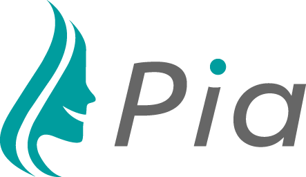

# Pia

Pia is a voice assistant. You can talk to her and give her reasonably natural commands and she will try to understand them and execute them. The commands are defined by voice apps.

## Features

### 100% Local

Pia works entirely on your computer and without Internet connection. Speech recognition and voice generation happen on your device, not in the cloud.

Pia encourages apps that keep all their data local. Keep all your contacts, personal calendar and emails, a huge music library, maps for the entire continent with you. You can even query the Wikipedia without calling the Internet.

#### All your data belongs to you

All your data stays on your device, and your device only. This is keeps information about your personal life private.

Optional sync to other devices locally via Wifi and Bluetooth is planned.

#### Always on

It also means that Pia can work in places where Internet connection is intermittent, for example in your car.

Obviously, Google searches, news, weather updates and so on will still call out to the Internet.

### 100% Open Source

All software involved is Free Software. That includes speech recognition, speech generation, and language processing. No proprietary services are needed for setup or adding skills. Everything happens on your computer and everything is Free Software. Our goal is to empower the end user.

